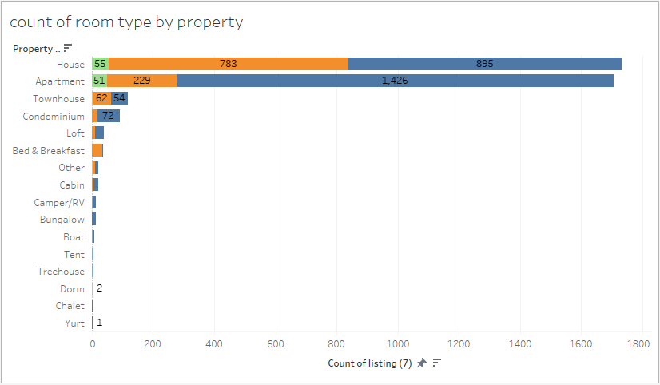
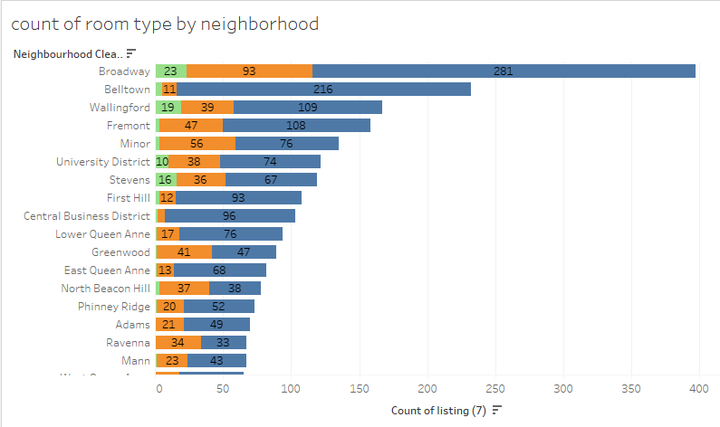
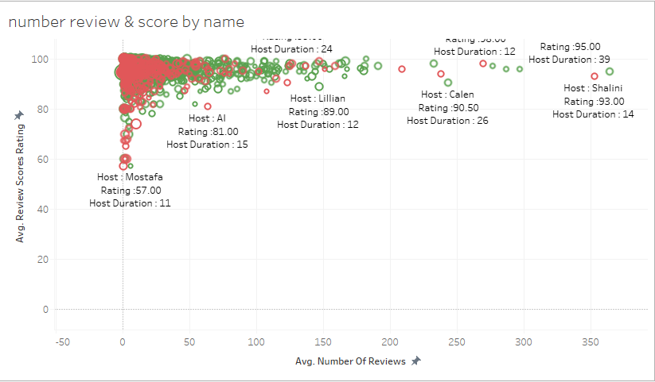
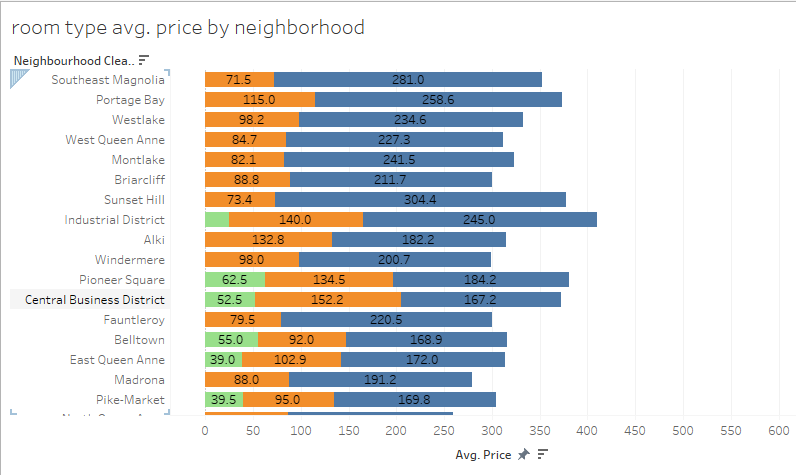
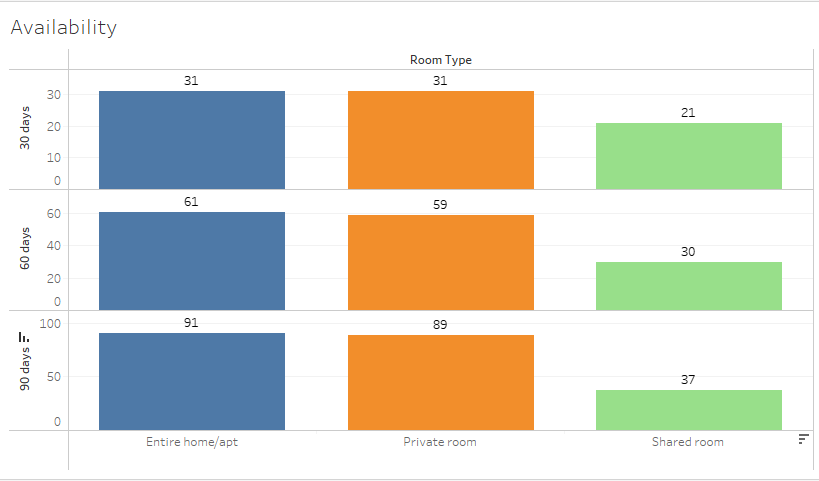

# CP372 Final Project : Seattle Airbnb Open Data 

## **ผลสรุปโครงการ**
- Dataset  : https://www.kaggle.com/datasets/airbnb/seattle/data
  
- Tableau : https://public.tableau.com/views/Airbnbinteractivedashboard_17477226194240/Dashboard1?:language=en-US&publish=yes&:sid=&:redirect=auth&:display_count=n&:origin=viz_share_link

- Youtube  : https://www.youtube.com/watch?v=nb4ImvqQlYg

## เกี่ยวกับ Dataset
ใน Repository นี้จะสำรวจข้อมูล **Seattle Airbnb Open Data** จาก Kaggle รวมไปถึงการทำความสะอาดข้อมูล, การสร้างฟีเจอร์ใหม่, และสร้างการพยากรณ์ (Regression) ราคาของห้องพัก ทั้งนี้สามารถเรียนรู้เพิ่มเติมเกี่ยวกับ Dataset ได้[ที่นี่](https://www.kaggle.com/datasets/airbnb/seattle/data)
ข้อมูลชุดนี้ประกอบไปด้วย 3 ไฟล์คือ
  + calendar.csv : เก็บข้อมูลเกี่ยวกับวันที่เข้าร่วมและความร้อมของการเข้าพัก
  + listing.csv  : เก็บข้อมูลเกี่ยวกับข้อมูลโดยรวมของห้องพักเช่น ไอดีของโฮสต์, จำนวนแต่ละห้อง, ความพรอมการเข้าพัก ฯลฯ
  + reviews.csv  : เก็บข้อมูลเกี่ยวกับผู้รีวิวห้องพัก และข้อความรีวิว

## **Project Canvas**
- **ปัญหา (Problem Statement)** : เจ้าของอสังหาริมทรัพย์แห่งหนึ่งใน Seattle มีความตั้งใจจะปล่อยเช่าห้องของตนเองสู่บริการ AirBnb แต่ทว่าเจ้าของอสังหาริมทรัพย์ท่านนี้ยังไม่เข้าใจว่าอะไรคือตัวกำหนดราคาห้องพัก
  
- **วัตถุประสงค์ทางธุรกิจ (Business Objectives)** : คาดการณ์ราคาที่เหมาะสมต่อที่พักแต่ละประเภท และวิเคราะห์ปัจจัยที่ส่งผลต่อระดับราคาของห้องพัก รวมไปถึงสร้าง dashboard สำหรับเจ้าของที่พักในการตัดสินใจเชิงกลยุทธ์
  
- **ผู้มีส่วนได้ส่วนเสีย (Key Stakeholders)** : มีผู้ที่มีส่วนได้ส่วนเสียดังนี้
  - เจ้าของที่พัก (Host): เพื่อปรับปรุงกลยุทธ์การตั้งราคาและเพิ่มโอกาสให้ที่พักถูกจอง
  - ผู้จัดการอสังหาริมทรัพย์หรือบริษัทปล่อยเช่า
  - นักลงทุนอสังหาริมทรัพย์ที่ต้องการประเมินทำเล
    
- **ตัวชี้วัดความสำเร็จ (Success Metrics)** : ใช้ตัวชี้วัดความสำเร็จดังนี้
  - ความแม่นยำของโมเดลการคาดการณ์ราคา (เช่น MAE หรือ RMSE) มากกว่า 0.50
  - การค้นพบ Insight สำคัญอย่างน้อย 3 ประเด็น ที่นำไปใช้ได้จริง
  - การสร้าง dashboard บน Tableau ที่มีผู้ใช้งานสามารถโต้ตอบ (interactive) ได้ 

## **การเตรียมข้อมูล (Data Preparation)**
ในขั้นตอนนี้ถูกกระทำบน colab notebook โดยสามารถดูได้ในไฟล์บน Repository นี้
- **การทำความสะอาดข้อมูล (Data Cleaning)** : เราจะแบ่งเป็นทั้งหมด 3 ไฟล์ดังนี้
    + calendar.csv : ข้อมูลที่ขาดหายมากที่สุดคือ price อยู่ที่ 32.9 เปอร์เซ็นต์ของข้อมูล จึงได้ตัดข้อมูลส่วนนี้ออก
    + listing.csv  : การทำความสะอาดข้อมูลในไฟล์นี้ มีดังนี้
        - Drop ข้อมูลที่ไม่จำเป็นต่อการวิเคราห์เช่น รูปภาพ, ลิงค์เว็บไซต์, ข้อความรีวิว เป็นต้น
        - Drop ข้อมูลที่มี missing values สูงอย่าง license, square_feet, weekly_price, monthly_price
        - การเติม missing values ดังนี้
            +  security_deposit, security_deposit : เติมข้อมูลที่ขาดหายด้วย '$0.00'
            +  host_listings_count, host_total_listings_count, review_scores_rating : เติมข้อมูลที่ขาดหายด้วยค่าเฉลี่ย (mean) ของข้อมูลนั้น ๆ
            +  host_response_time, host_acceptance_rate : เติมข้อมูลที่ขาดหายด้วย 'Unknown'
            +  host_since, property_type, bathrooms, bedrooms, beds : เติมข้อมูลที่ขาดหายด้วยค่าฐานนิยม (mode)
            +  host_identity_verified : เติมข้อมูลด้วย 'FALSE'
            +  zipcode : เนื่องจากจำนวนข้อมูลที่ขาดหายไปมีจำนวนน้อยมาก ๆ เพื่อให้สมบูรณ์จึงใช้การสืบค้นบนอินเทอร์เน็ต
            +  การลบเครื่องหมายที่ไม่จำเป็นจากข้อมูลเช่น '$', '{}' หรือ '%' เป็นต้น
    + reviews.csv  : ข้อมูลที่ขาดหายไปคือ comments อยู่ที่ 0.02 เปอร์เซ็นต์ของข้อมูล จึง Drop ออกไป
  - **การสร้างคุณลักษณะใหม่ (Feature Engineering)** : ทั้งหมดถูกสร้างบนไฟล์ **listing.csv** โดยมีคุณลักษณะใหม่ดังนี้
      + host_duration_years : การรวมเวลาที่เปิดมาทั้งหมดของห้องพักนั้น ๆ จากวันที่เข้าร่วม 
      + price_per_person    : การหาราคต่อคนในกรณีที่ผู้เข้าพักมากกว่า 1 คน
      + avilability_ratio   : เปอร์เซ็นต์ความพรอมในการเข้าพัห จากจำนวนที่เปิดจริงต่อปี ในรูปแบบเปอร์เซ็นต์
   
## **การสำรวจข้อมูลเบื้องต้น (Exploratory Data Analysis, EDA)**
ในขั้นตอนนี้ สามารถเข้าไปสำรวจ Dashboard จาก Tableau ที่เราสร้างได้ [ที่นี่](https://public.tableau.com/views/Airbnbinteractivedashboard_17477226194240/Dashboard1?:language=en-US&publish=yes&:sid=&:redirect=auth&:display_count=n&:origin=viz_share_link)
โดยเราได้พบ 5 รูปแบบสำคัญหรือความผิดปกติ ดังนี้  

1. จำนวนประเภทห้องพักแยกตามประเภทที่พัก

  จากกราฟที่ประเภทของที่พักจะเป็นบ้านและอพาร์ตเมนต์เป็นอันดันที่ 1 และ 2 ตามลำดับซึ่งทำให้ได้รับความนิยมสูงสุด โดยมีจำนวนห้องพักมากกว่าประเภทอื่น ๆ อย่างชัดเจน แสดงให้เห็นว่าผู้ให้เช่าส่วนใหญ่เลือกปล่อยเช่าผ่านที่พักประเภท 

2. จำนวนประเภทห้องพักแยกตามย่าน

  กราฟนี้แสดงให้เห็นว่าในแต่ละย่านมีสัดส่วนของประเภทห้องพักที่แตกต่างกันไป บางย่านอาจมี Entire home/apt (บ้านทั้งหลัง) มากกว่า ขณะที่บางย่านเน้น Private room (ห้องส่วนตัว) ซึ่งสะท้อนถึงลักษณะชุมชนหรือพื้นที่ เช่น ย่านท่องเที่ยวอาจมี entire home/apt มากกว่า 

3. จำนวนรีวิวและคะแนนรีวิวแยกตามชื่อผู้ให้เช่า/ชื่อประกาศ

  กราฟนี้เปรียบเทียบ จำนวนรีวิว และ คะแนนรีวิว ตามผู้ให้เช่าหรือชื่อประกาศต่าง ๆ โดยผู้ให้เช่าที่มีจำนวนรีวิวสูงมักจะมีความน่าเชื่อถือ และคะแนนรีวิวช่วยชี้ให้เห็นถึงคุณภาพของการให้บริการโดยที่การยืนยันตัวตนของผู้ให้เช่ามีแบะระยะเวลาที่เป็นผู้ให้เช่า มีผลต่อคะแนน 

4. ราคาเฉลี่ยของแต่ละประเภทห้องพัก แยกตามย่าน

  กราฟนี้สามารถวิเคราะห์ได้ว่า ย่านไหนมีราคาสูง-ต่ำ และประเภทห้องพักไหนในย่านนั้นมีค่าเฉลี่ยสูงสุด เช่น Entire home/apt ในย่านกลางเมือง มักมีราคาสูงกว่าประเภทห้องอื่น ๆ แสดงถึงความต้องการและทำเลที่ตั้งที่ส่งผลต่อราคา 

5. ความพร้อมให้เช่า
   

  กราฟนี้แสดงจำนวนวันที่ที่พัก พร้อมให้เช่าในช่วงเวลา 30, 60 และ 90 วัน จำแนกตามประเภทห้องพัก โดย:
  - Entire home/apt และ Private room มีจำนวนวันที่พร้อมให้เช่าสูงสุด 
  - Shared room มีความพร้อมให้เช่าต่ำกว่าในทุกช่วงเวลาข้อมูลนี้ช่วยให้เห็นแนวโน้มว่าที่พักประเภทใดสามารถเข้าพักได้ตลอดและมีการบริหารจัดการที่ดี

## **การวิเคราะห์เชิงลึก (In-Depth Analysis)**
ในขั้นตอนนี้เราได้คิดคำถามการวิเคราะห์เชิงลึกดังนี้ :
1. สิ่งอำนวยความสะดวกใดส่งผลให้ราคาห้องสูงขึ้นมากที่สุด?
2. จำนวนห้องน้ำ ห้องนอน และเตียง ส่งผลต่อราคาห้องพักอย่างมีนัยสำคัญหรือไม่ และความสัมพันธ์นั้นเป็นแบบเชิงเส้นหรือไม่?

ในขั้นตอนนี้เราได้ใช้การพยากรณ์ด้วย **XGBoost Regressor** สามารถเรียนรู้เพิ่มเติมได้[ที่นี่](https://www.geeksforgeeks.org/xgboost-for-regression/.) โดยผลลัพธ์และขั้นตอนการสร้างทำหมด สามารถสำรวจได้ใน Repository นี้

## **ข้อค้นพบและข้อเสนอแนะ (Insights & Recommendations)**
- สรุป ข้อค้นพบเชิงปฏิบัติการ (actionable insights) 3 อันดับแรก :
    + ขนาดห้องพักส่งผลต่อราคาชัดเจน : ที่พักที่มีจำนวนห้องนอนและห้องน้ำมากกว่ามีแนวโน้มตั้งราคาสูงขึ้นอย่างมีนัยสำคัญ 
    + Host ที่ได้รับการยืนยันตัวตนและมีประสบการณ์ (host_duration_years สูง) สามารถตั้งราคาสูงกว่า
    + การมีสิ่งอำนวยความสะดวกพื้นฐาน (เช่น Kitchen, Washer, Dryer, Air Conditioning) เป็น "ขั้นต่ำ" ที่ลูกค้าคาดหวัง

- เสนอ ข้อแนะนำ สำหรับผู้มีส่วนได้เสีย : เมื่อได้ทราบตามข้อค้นพบเชิงปฏิบัตรการจะได้ข้อแนะนำดังนี้ :
    + เจ้าของที่พักสามารถเพิ่มเตียงหรือจัดห้องใหม่ให้ดูรองรับคนได้มากขึ้น เพื่อเพิ่มราคาต่อคืน
    + สำหรับผู้เริ่มต้น แนะนำให้ทำการยืนยันตัวตนและเก็บรีวิวในช่วงแรกเพื่อเพิ่มความน่าเชื่อถือและราคาที่สามารถตั้งได้
    + ที่พักที่ไม่มี amenities เหล่านี้จะถูกตั้งราคาต่ำหรือไม่ถูกจองเลย ควรลงทุนเพื่อให้ได้มาตรฐานขั้นต่ำก่อนปรับราคาขึ้น

- ให้เหตุผลสนับสนุนด้วยหลักฐานจากการวิเคราะห์ : มีเหตุผลรับรองข้อค้นพบเชิงปฏิบัตรการดังนี้
    + จาก Feature Importance ของ XGBoost Regressor พบว่า bedrooms และ bathrooms อยู่ในกลุ่ม Top 5 ของฟีเจอร์ที่ส่งผลต่อราคามากที่สุด
    + จาก XGBoost importance: host_identity_verified (t/f) และ host_duration_years เป็นตัวแปรที่มีผลชัดเจนต่อราคา
    + จากการเปรียบเทียบใน Tableau: Host ที่เปิดมากกว่า 3 ปีและมี verified identity สามารถตั้งราคาสูงกว่ากลุ่มใหม่มากถึง 30%
    + ห้องพักที่ไม่มี amenity เช่น Kitchen, Washer, Air Conditioning มีราคาต่ำกว่าเฉลี่ยถึง 20–30%
    + จาก Dashboard แสดงว่า listings ที่ไม่มี amenities เหล่านี้มักถูกจองน้อยหรือมี rating ต่ำ
